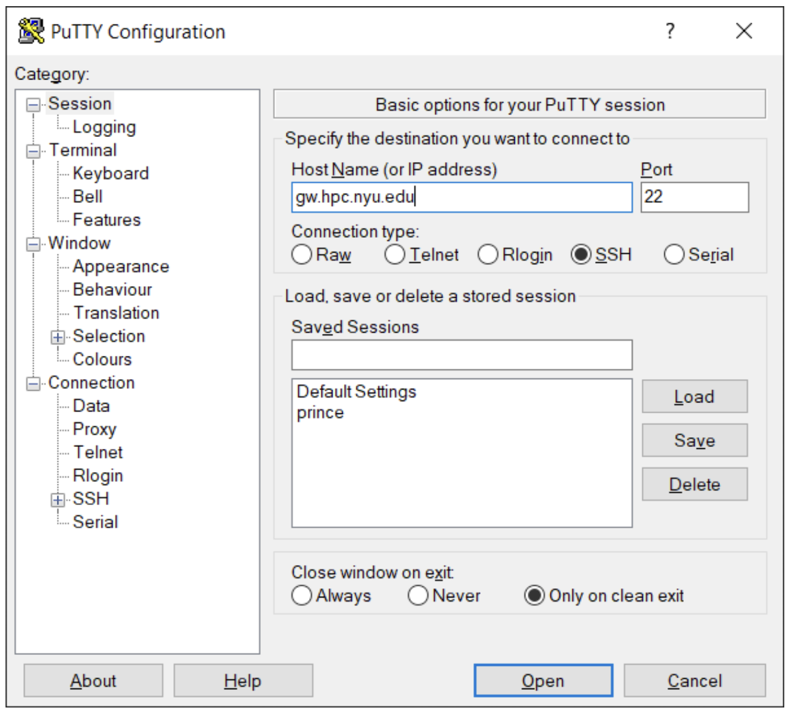

### PuTTY (Only for Windows)

There are many SSH clients for Windows, but we recommend installing and using [PuTTY SSH](https://www.chiark.greenend.org.uk/~sgtatham/putty/latest.html). 

Once it is installed, launch PuTTY and configure a new session at the "Session" category as shown in the screenshot below: 



Here we are instructing PuTTY to connect to host `gw.hpc.nyu.edu` on `port 22` using SSH protocol (note, that this interface allows you to save this connection configuration for future). Just like for Linux and Mac users, if you are connecting from the outside of NYU network, you need to go through the gateway servers.

Once you click `Open`, a terminal window with prompt for password will pop up. Enter your NetID password and you should be authorized on the gateway server. Gateways are designed to support only a very minimal set of commands and their only purpose is to let users access HPC systems. Once you are there type in an ssh command that will let you connect to Greene cluster :

```sh
ssh greene.hpc.nyu.edu
```

A new command line interface window will open up that prompts you for your password on the gateway server, from there you can connect to Greene by entering the following:

```sh
ssh greene.hpc.nyu.edu
```


