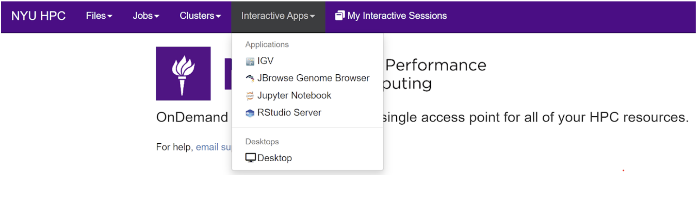

# Open OnDemand 

( A Web-based Graphical User Interface )

Open OnDemand is an [open source project](https://openondemand.org/) funded by the National Science Foundation (NSF). Open OnDemand is designed to create easier access to users to interface with HPC systems. Originally developed by Ohio Supercomputer Center (OSC), used by many universities around the world, and now servicing the NYU Greene HPC cluster.

Open OnDemand has a variety of convenient tools to manage files, access the command line, manage and monitor jobs, and launch interactive applications, such as Jupyter Notebooks, RStudio sessions, and even full Linux Desktops. 

Features Include:

- Easy file management - upload and download files, view HTML and pictures without downloading

- Command-line shell access without any SSH client locally installed

- Job management and monitoring

- Full Linux desktop experience without X11

- Interactive Apps such as JupyterHub and RStudio without the need for port forwarding

Open OnDemand (OOD) is accessible to all users with a valid NYU HPC account while on-campus network or through a VPN.

To access OOD visit: [https://ood.hpc.nyu.edu](https://ood.hpc.nyu.edu) (VPN Required)

## Access the Shell 

Under the `clusters` menu you can select the `Greene Shell Access` option to access the Linux shell. No local SSH client is required.


### Interactive Applications

GUI based applications are accessible without the need for port or X11 forwarding. Select the Interactive Apps menu, select the desired application, and submit the job based on required resources and options. 



### Troubleshooting Connections to Open OnDemand

A common issue that can occur is receiving an error that the Open OnDemand page cannot be reached. Sometimes this can indicate that the service is down, but often this is an issue with the the local browser cache. You can test this by opening a private browser window and seeing if https://ood.hpc.nyu.edu will load. If it does, try deleting the cache for https://ood.hpc.nyu.edu in your browser history to resolve this issue.

In Chrome, this can be done by navigating to this page in your settings:

```sh
chrome://settings/content/all?searchSubpage=ood.hpc.nyu.edu&search=site+data
```

The link above will automatically search for the Open OnDemand site data and cookies. You can then simply click on the trashcan icon to delete the site cache.

Once done, try navigating again to https://ood.hpc.nyu.edu and the site should load. For other issues please email hpc@nyu.edu.

