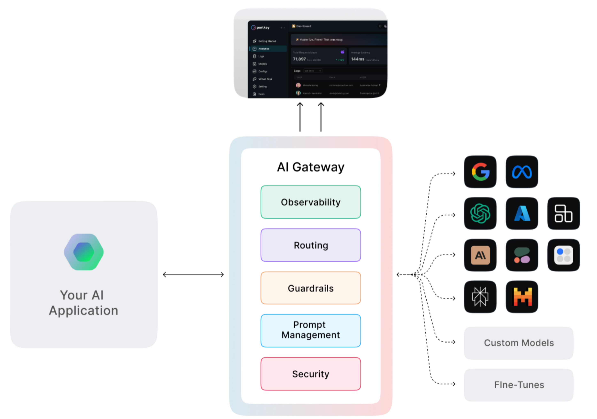

# Portkey

[Portkey](https://portkey.ai/docs/introduction/what-is-portkey) is an enterprise-grade LLM gateway running on-prem:



Broadly it facilitates:
-   **Route requests** via configurations that can allow for fallbacks, load balance, etc
-   **Observability** via the control pane that displays your usage statistics and logs. You can retrive your logs via an API.
-   **Prompt management** via the prompt playground. You can compare the respone for a prompt across multiple LLMs, collaborate with your team and export your prompts.
-   **Guardrails** usage by allowing you to define them or integrate with third party guardrails.
-   **Agentic workflows** by integrating with various agentic frameworks like langchain, llamaindex, etc.
-   **Security & Governance** by allowing you to set budget and rate limits on the API keys created for your workspace

:::tip[Gateway URL]
Whenever you instantiate a Portkey client, the `base_url` must be set to `base_url="https://ai-gateway.apps.cloud.rt.nyu.edu/v1/"`. If you miss this parameter you would be connecting to the vendor's SaaS platform and NYU provisioned virtual keys will not work.
:::

## Onboarding
Send an email to `genai-support@nyu.edu` to start the onboarding process.

## Getting started with Portkey
As part of the onboarding process, you would have received an invite which gives you access to a workspace. We will also add virtual keys for LLMs to your workspace as part of the onboarding process. Once you've accepted it, head over to `https://app.portkey.ai/` and select the sign-in with Single Sign-On option and proceed with your NYU email address.

:::danger[Access to Portkey is only permitted via NYU VPN]
You need to be connected to the NYU VPN to access the Portkey LLM gateway. If you are not, your requests will timeout and result in connection errors.
:::

You will now be able to create an API key for yourself by access the `API Keys` item on the left sidebar. With an API key and a virtual key at your disposal, you can now run the following script:
```python
from portkey_ai import Portkey

portkey = Portkey(
    base_url="https://ai-gateway.apps.cloud.rt.nyu.edu/v1/",
    api_key="",  # Replace with your Portkey API key
    virtual_key="",  # Replace with your virtual key for Google
)

completion = portkey.chat.completions.create(
    messages=[
        {"role": "system", "content": "You are not a helpful assistant"},
        {"role": "user", "content": "Say this is a test"},
    ],
    model="gemini-2.0-flash-lite-preview-02-05",
)

print(completion)
```

Once the script is executed, you can head back to `app.portkey.ai` to view the logs for the call!
