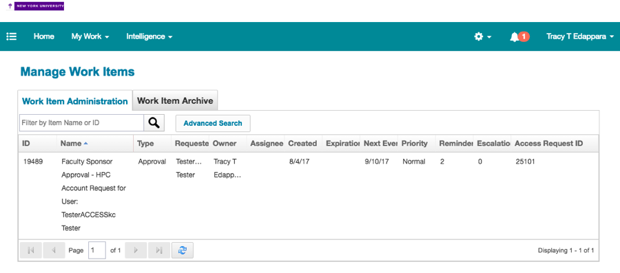
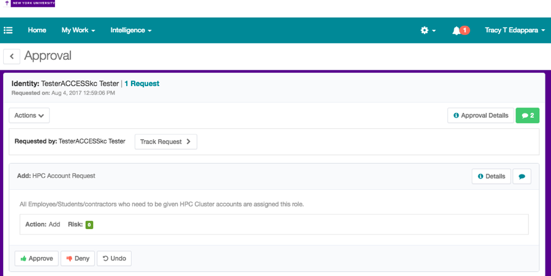

# How to approve an HPC Account Request

When someone nominates you as their HPC sponsor, you should be notified by email. You can also [log into IIQ at any time](https://iiq.nyu.edu/identityiq), and if you have a request awaiting your approval, it will appear in your "Actions Items" box, as per the following screenshot:

Another way to get to pending approvals is to click on the line item in the “Latest Approvals” section which will lead directly to the approval page. For new HPC Account Requests, the page will look like this:

Here, the Approve or Deny button should be clicked, then confirmed, in order to complete the request.

If you have any difficulties or questions, please contact us at hpc@nyu.edu.

