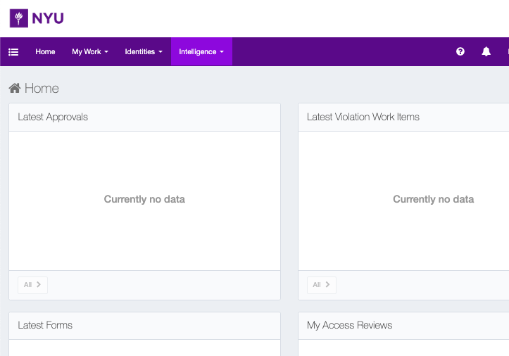
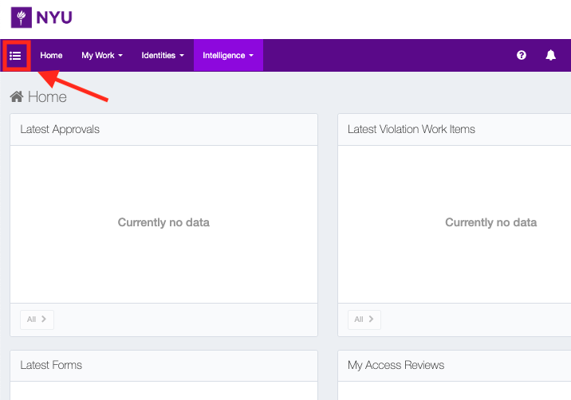
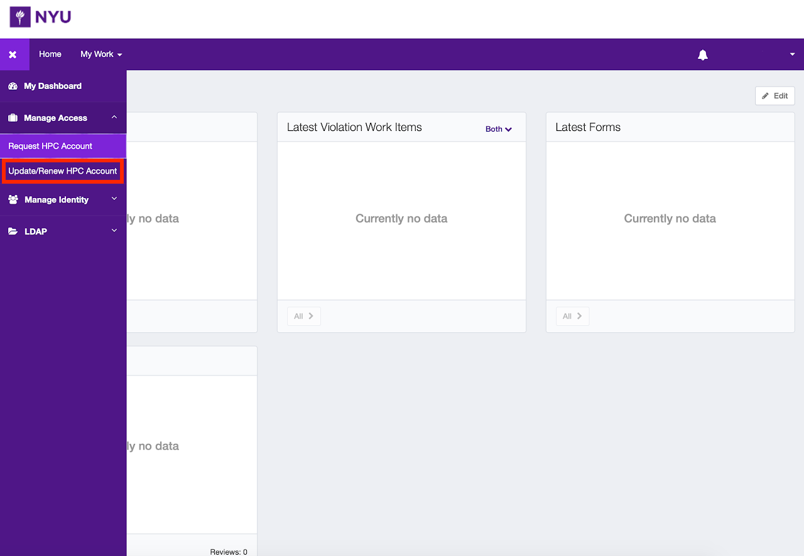
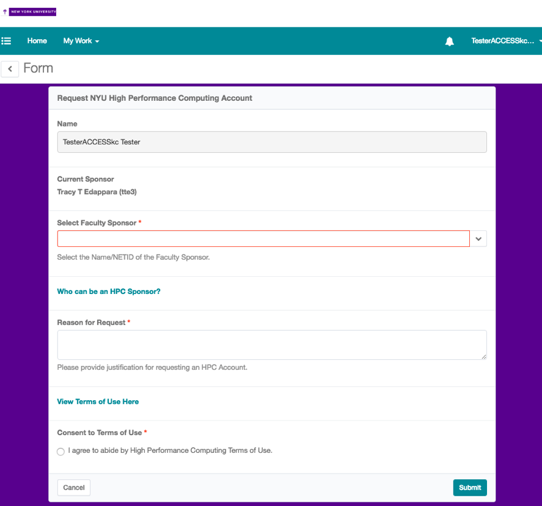
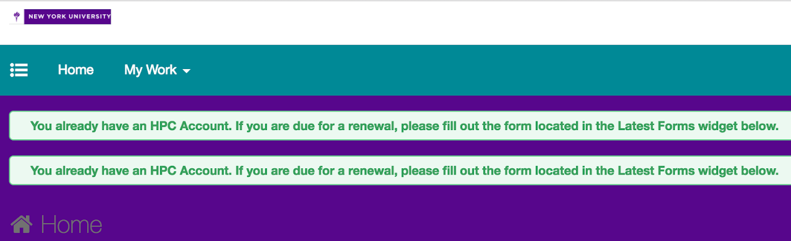

# Renewing your HPC Account with IIQ

Login to the URL given below, using your netid/password, to create or manage HPC Account Requests:

https://identity.it.nyu.edu/  (NYU VPN is required)

Upon logging in, an end user’s landing page will look like this

If the menu does not appear, select the "burger" menu on the top left hand corner:

The burger menu will show an "Update/Renew HPC Account" option - select this.

Next complete the form as instructed. Please note that all accounts require the sponsorship of a full-time NYU faculty member.

The user’s name will be pre-populated, and the forms required fields must be completed (sponsor, reason for request, consent to terms of use).  After clicking “Submit” the chosen sponsor will be notified of the request and provisioning will only occur after approval.

NOTE: If your HPC Account is due for renewal you will get an update on your dashboard which will suggest you to fill out a form given in the "Latest form" widget for renewing your account

If you are not a full-time NYU faculty member, you will need an NYU faculty member to sponsor your application. This is probably your thesis supervisor, or NYU collaborator.

Hit submit, and the request will go to your sponsor to approve (if applicable), and your account will be created, usually within a day of being approved.

You will be returned to the dashboard, and now you should see your request in the "Pending Approvals" tables.

If after a few days you still do not have an account, check with your sponsor - they may have missed a step in the approval process. If you are still stuck, contact us at hpc@nyu.edu for assistance.
