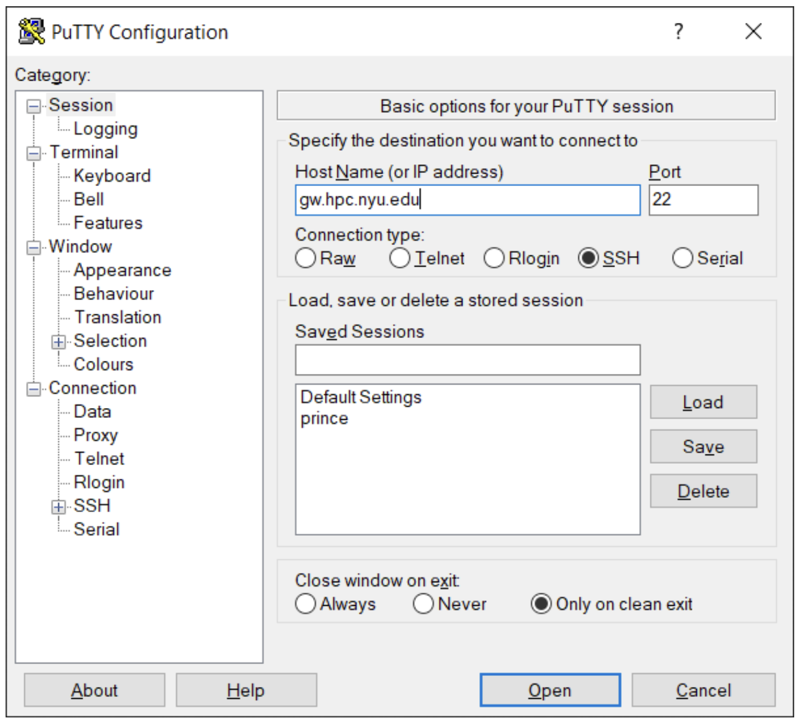

# Connecting to the HPC Cluster

There are several ways to interact with the Greene HPC cluster. Similar to other Linux clusters, the most common method of connection is via a Command Line Interface (CLI). A CLI is a program that allows you to create and delete files, run programs, and navigate through directories and files via a typed prompt. On Mac, the built-in CLI application is called Terminal. While Windows 11 machines support a Linux Subsystem, which allows for similar functionality, a popular tool used to connect to a Linux server is a free application called [PuTTY][putty link]. 

If you'd prefer to access the HPC cluster via a web gateway instead, please refer to [the section describing OpenOnDemand](./03_ood.md).

The following sections will outline basic ways to connect to the Greene cluster. Access to the clusters is primarily handled via the Secure Shell Protocol, or ssh. Below we outline ways to connect via ssh on Mac, Linux, and Windows machines.

## Remote Connections with the NYU VPN & HPC Gateway Server

If you are connecting from a remote location that is not on the NYU network (your home for example), you have two options:

1. **VPN Option:** [Set up your computer to use the NYU VPN][nyu vpn link]. Once you've created a VPN connection, you can proceed as if you were connected to the NYU net

2. **Gateway Option:** Go through our gateway servers (example below). Gateways are designed to support only a very minimal set of commands and their only purpose is to let users connect HPC systems without needing to first connect to the VPN

You do not need to use the NYU VPN or gateways if you are connected to the NYU network (wired connection in your office or WiFi) or if you have VPN connection initiated. In this case you can ssh directly to the clusters.

## Command Line Interface (Use Terminal)

### Mac & Linux Access

To connect to the gateway servers, simply open a [terminal application][apple terminal link] and enter the following command:

```sh
ssh <NetID>@gw.hpc.nyu.edu
```

After typing in your password you will be logged in to the cluster. Once this connection is established, you can make one more hop and connect to one of the HPC clusters:

```sh
# this will connect you to Greene HPC cluster
ssh <NetID>@greene.hpc.nyu.edu
```

### Windows CMD

Windows 11 users have several options. First, the CMD program should contain an ssh client, allowing you to log into Greene or Hudson the same way as with a Linux terminal.

### Windows WSL2

If you run Windows 10, you can install WSL, and then install Ubuntu or other Linux distribution (for example, from Microsoft Store). You will have a fully functional Ubuntu with terminal and can connect to cluster using instructions provided above for Linux/Mac users.

Instructions on WSL installation can be found here: [https://docs.microsoft.com/en-us/windows/wsl/install-win10][wsl installation link]

:::tip
-   One of many options to get terminal that support tabs, etc. is to install 'Windows Terminal' from Microsoft Store.
-   If you are using WSL 2 (Windows subsystem for Linux), you may not be able to access internet when Cisco AnyConnect VPN, installed from exe file, is activated. A potential solution: uninstall Cisco AnyConnect and install AnyConnect using Microsoft Store, and then setup new VPN connection using settings described on [IT webpage][install vpn on windows link].
:::

### Setting up SSH Keys

Instead of typing your password every time you need to log in, you can also specify an ssh key.

- Only do that on the computer you trust

- Generate ssh key pair (terminal in Linux/Mac or cmd/WSL in Windows):
    [https://www.ssh.com/ssh/keygen/][ssh instructions keygen link]

- Note the path to ssh key files. Don't share key files with anybody - anybody with this key file can login to your account

- Log into cluster using regular login/password and then add the content of generated public key file (the one with .pub) to `$HOME/.ssh/authorized_keys` on cluster

- Next time you will log into cluster no password will be required

For additional recommendations on how to configure your SSH sessions, see the \[ssh configuring and x11 forwarding page].

## PuTTY (Only for Windows)

There are many SSH clients for Windows OS, but we recommend using [PuTTY SSH][putty link] if you have not already. Once it is installed, launch PuTTY and configure new session "Session" category as in the screenshot below:



Here we are instructing PuTTY to connect to host gw.hpc.nyu.edu on port 22 using SSH protocol (note, that this interface allows you to save this connection configuration for future). Just like for Linux and Mac users, if you are connecting from the outside of NYU network, you need to go through the gateway servers.

Once you click "Open", a terminal window with prompt for password will pop up. Enter your NetID password and you should be authorized on the gateway server. Gateways are designed to support only a very minimal set of commands and their only purpose it to let users access HPC systems. Once you are there type in an ssh command that will let you connect to Greene cluster :

```sh
# Greene Login
ssh greene.hpc.nyu.edu
```

A new command line interface window will open up that prompts you for your password on the gateway server, from there you can connect to Greene by entering the following:

```sh
ssh greene.hpc.nyu.edu
```


[putty link]: https://www.chiark.greenend.org.uk/~sgtatham/putty/latest.html

[nyu vpn link]: https://www.nyu.edu/life/information-technology/infrastructure/network-services/vpn.html

[install vpn on windows link]: https://nyu.service-now.com/sp?sys_kb_id=6177d7031c811904bbcf4dc2835ec340&id=kb_article_view&sysparm_rank=3&sysparm_tsqueryId=9a07fee81b146410a54ffdd51a4bcb8e

[apple terminal link]: https://support.apple.com/guide/terminal/open-or-quit-terminal-apd5265185d-f365-44cb-8b09-71a064a42125/mac#:~:text=Open%20Terminal,%2C%20then%20double%2Dclick%20Terminal.

[wsl installation link]: https://docs.microsoft.com/en-us/windows/wsl/install-win10

[ssh instructions keygen link]: https://www.ssh.com/ssh/keygen/
