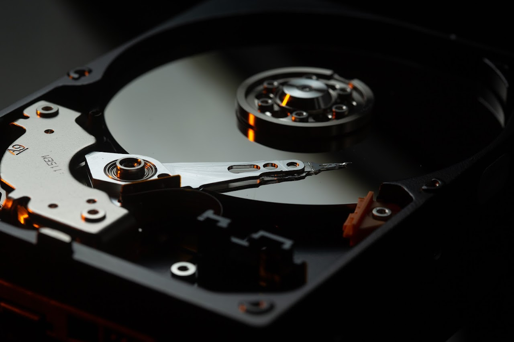

# HPC Storage

The NYU HPC clusters are served by a General Parallel File System (GPFS) cluster and an all Flash VAST storage cluster.

The NYU HPC team supports data storage, transfer, and archival needs on the HPC clusters, as well as collaborative research services like the Research Project Space (RPS).

## Highlights
-   9.5 PB Total GPFS Storage
    -   Up to 78 GB per second read speeds
    -   Up to 650k input/output operations per second (IOPS)
-   Research Project Space (RPS): RPS volumes provide working spaces for sharing data and code amongst project or lab members

