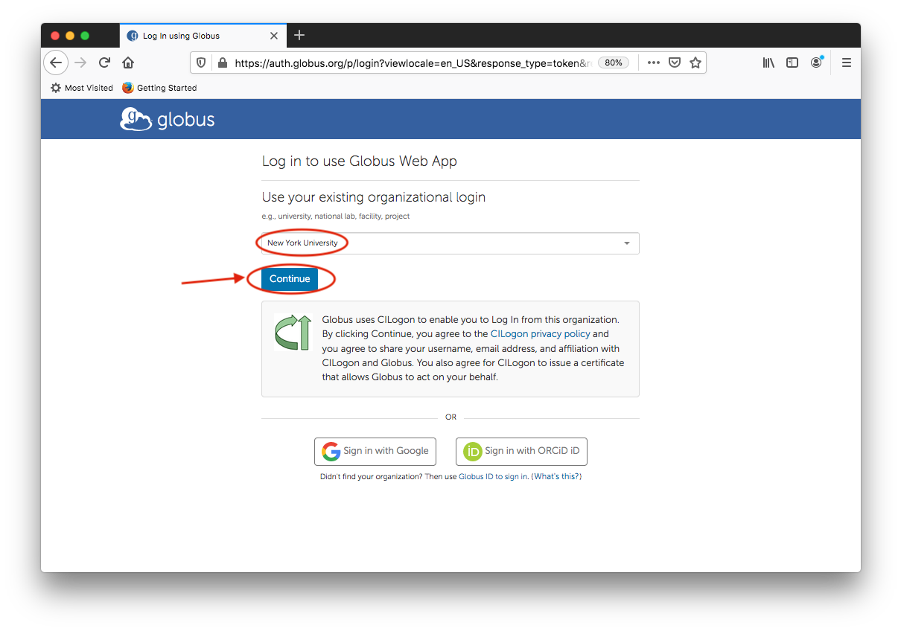
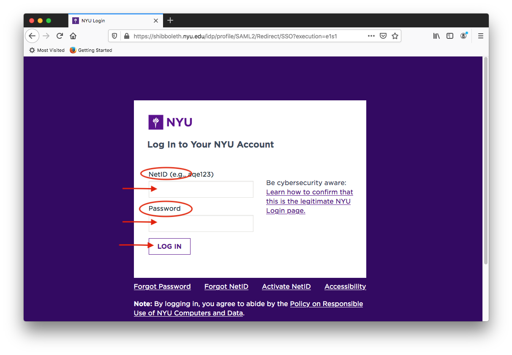
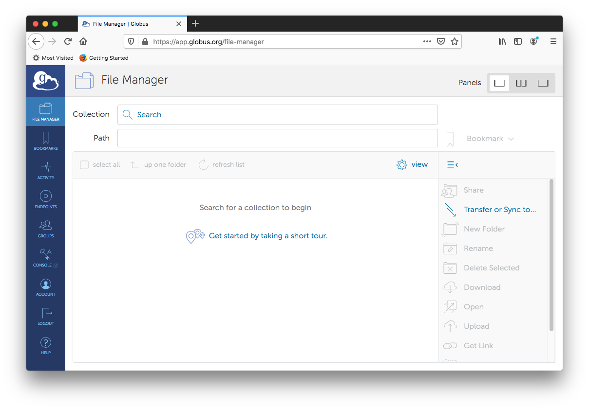
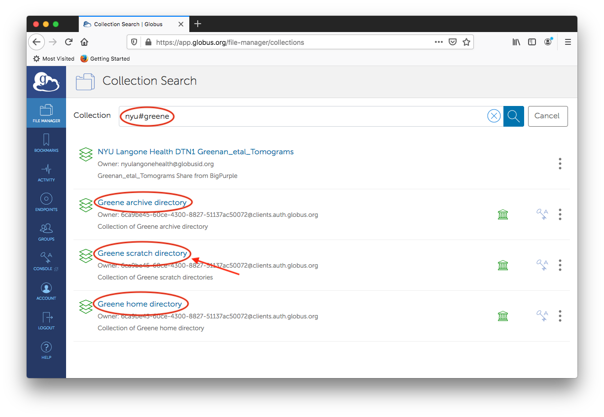
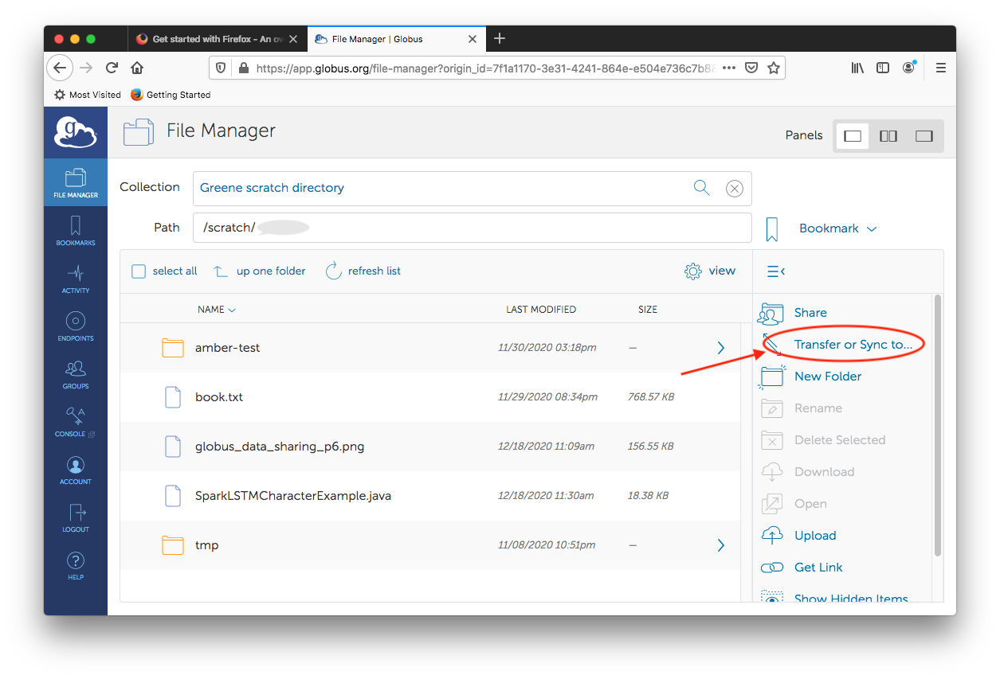
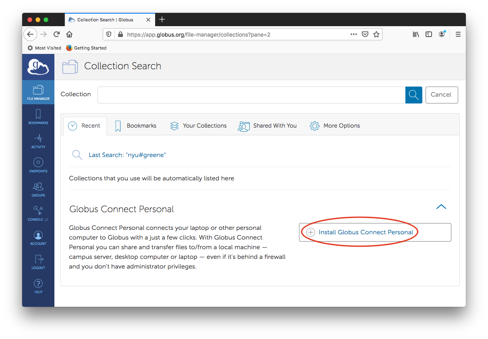
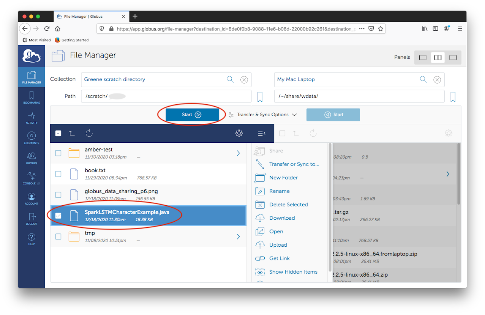
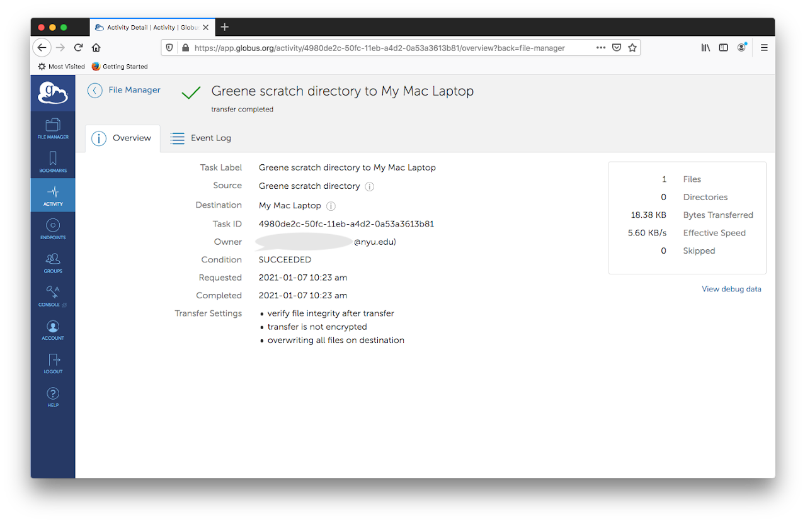
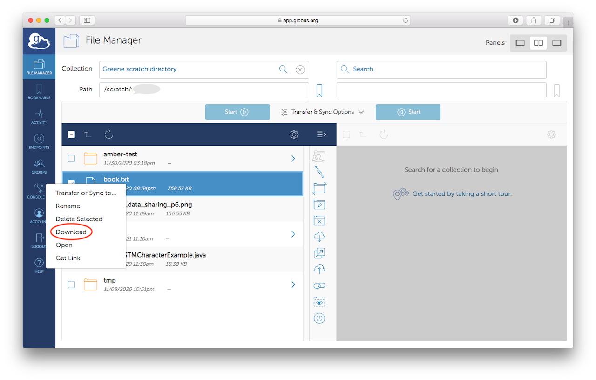

# Globus

The Globus project aims at providing powerful tools for scientific data management, to help researchers to focus on their domain subjects and solve data intensive research problems. Globus has been grown maturely to enable grid computing by connecting computing resources distributed globally across organizational boundary. Universities, national laboratories and computing facilities are using services of Globus.

## Transferring data between endpoints
### Endpoint

A globus **Endpoint** is a data transfer location, a location where data can be moved to or from using Globus transfer, sync and sharing service. An endpoint can either be a ***personal endpoint*** (on a user’s personal computer) or a ***server endpoint*** (located on a server, for use by multiple users). [Please read for details.](https://www.globus.org/data-transfer)

### Collection

A collection is a named set of files (or blobs), hierarchically organized in folders.

### Data Sharing

How to share data using Globus is described: [https://docs.globus.org/how-to/share-files/](https://docs.globus.org/how-to/share-files/)

The first step in transferring data is to get a Globus account at [https://www.globus.org/](https://www.globus.org/). Click on "Log in" at upper right corner. Select "New York University" from the pull-down menu and click on "Continue".

Enter your NYU NetID and password in the familiar screen, and hit "LOGIN" then go through the Multi-Factor Authentication.

The "File Manager" panel should come up as the following image. In order to be able to transfer files, you will need to specify two Collections. A collection is defined on top of an endpoint. We can search for a collection using an endpoint name. The **Server Endpoint** on the NYU HPC storage is **nyu#greene** .

## Server and Personal Endpoints
:::note
The NYU HPC Server Endpoint: nyu#greene
:::

**Globus Connect Server** is already installed on the NYU HPC cluster creating a ***Server Endpoint*** named **nyu#greene**, that is available to authorized users (users with a valid HPC account) using Globus. If you want to move data to or from your computer and the NYU HPC cluster, you need to install **Globus Connect Personal** on your computer, thus creating a ***Personal Endpoint*** on your computer.

### Moving data between Server Endpoints

If you plan to transfer data between ***Server Endpoints***, such as between the NYU server endpoint **nyu#greene** and a server endpoint at another institution, you do not need to install Globus Connect Personal on your computer.

#### Creating a Personal Endpoint on your computer

This needs to be done only once on your personal computer.  

After clicking "Transfer or Sync to...", click "Search" on the upper right side. Then follow the link "Install Globus Connect Personal".

More information about **Globus Connect Personal** and download links for Linux, Mac and Windows can be found at:  [https://www.globus.org/globus-connect-personal](https://www.globus.org/globus-connect-personal)

### Transfer files between your Personal Endpoint and NYU nyu#greene
To transfer files you need to specify two collections (endpoints). Specify one of them as **Greene scratch directory**, or **Greene archive directory** or **Greene home directory**. The other endpoint is the one created for your personal computer (e.g. My Mac Laptop) if it is involved in the transfer. When you first use the Greene directory collection, authentication/consent is required for the Globus web app to manage collections on this endpoint on your behalf.

When writing to your Greene archive directory, please pay attention that there is a default inode limit of 20K per user.  

When the second Endpoint is chosen to be your personal computer, your computer home directory content will show up. Now select directory and files (you may select multiple files when clicking on file names while pressing down "shift" key), click one of the two blue Start buttons to indicate the transfer direction. After clicking the blue Start button, you should see a message indicating a transfer request has been submitted successfully, and a transfer ID is generated. Globus file transfer service takes care of the actual copying.

When the transfer is done, you should receive an email notification. Click "ACTIVITY" on the Globus portal, select the transfer you want to check, a finished transfer should look like the following:

### Small file download from web browsers

Globus support HTTPS access to data. To download a small file from your web browser, select a file and right-click your mouse, then click 'Download' at the popup menu. 

Additional info can be found at this page [https://docs.globus.org/how-to/get-started/](https://docs.globus.org/how-to/get-started/). Feel free to send any question. Good luck!
