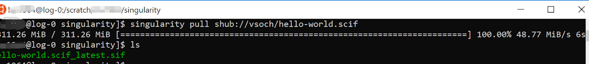
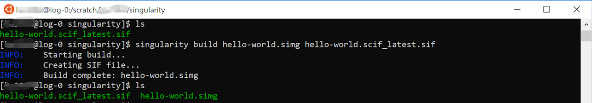
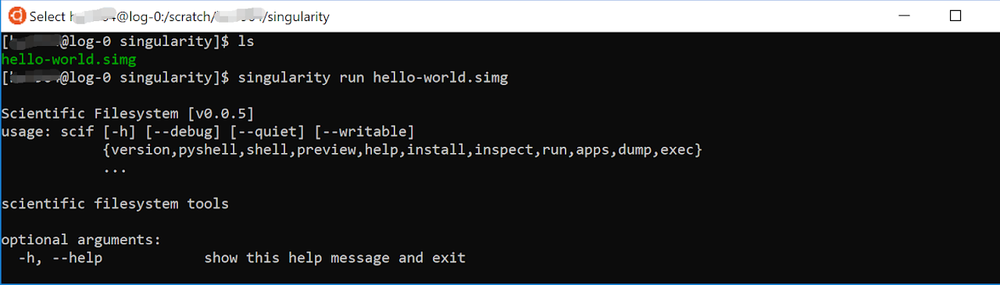
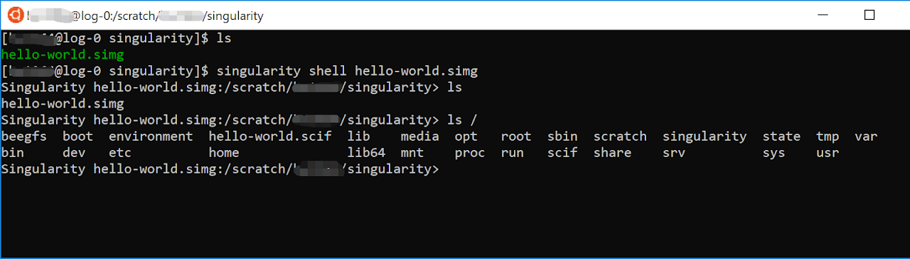
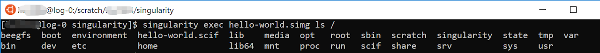

# Singularity: Run Custom Applications with Containers

## What is Singularity
Singularity is a container based Linux kernel workspace that works just like docker.  You can run pre-built programs in containers without having to worry about the pre-install environment.

For users who are familiar with Docker containers, Singularity works very similarly, and can even run Docker containers.

For a detailed introduction on Singularity, visit their official site [here](https://apptainer.org/documentation/)

## why do we use Singularity
There are multiple reasons to use Singularity on the HPC clusters:
1. Security: Singularity provides a layer of security as it does not require any root access on our clusters. This makes it safer against malware and bad scripts that might jeopardize the outer system. Thus we only support Singularity on our clusters(there are not other options such as Kubernetes or Docker on our clusters right now)
2. Containerization: Singularity will run all your images(packaged and pre-built programs) inside of its containers, each container works like a small vm. They contain all the required environment and files of a single Linux kernel and you don't have to worry about any pre-installation nonsense
3. Inter-connectivity: Containers are able to talk to each other, as well as the home system, so while each container has its own small space, they are still a part of a big interconnected structure. Thus enabling you to connect your programs.
4. Accessibility: Probably the most important feature of all, Singularity allows you to run your program in 2 to 3 simple steps, as shown in the topic how to run a singularity container. 

## how to run a singularity container
There are 3 steps to run a Singularity container on our clusters:

pulling a image from Singularity hub or Docker hub
```sh
$ singularity pull <image name>
# image name can be for example shub://vsoch/hello-world or docker://godlovedc/lolcow
``` 



build the image
```sh
$ singularity build <a name of your choosing>.simg:rw <image name>
# the image name can be a local image or an image from a hub
```
We add the :rw tag at the end of the .simg to explicitly give it "read and write" permissions while building.



You can now run your container using the built image:

run container
```sh
# this is one way of running a container
$ singularity run <image name>.simg:ro
# this is another way to run a container
$ ./<image name>.simg:ro
```

Unlike in the build phase, we add the :ro tag which means "read only" - as we are now just executing the image, not building it, and thus do not need it to be written. Writing access causes the Singularity image to be locked and it can become inaccessible while it is in read/write mode, so read only mode is best for executing commands.

running this would yield a menu for output:



go into container
```sh
singularity shell <image name>.simg:ro
# after this step, you will be going into the container and start your programming
```



you can run commands for the container using exec arguments without actually going into the container
```sh
$ singularity exec <image name>.simg:ro <commands>
# adding commands to the back will return the display result of these commands in the container without actually going into the container
```

Example:



That's it! Now you're good to go and can just use these simple steps to run singularity images and run your programs

For full information and documentation on Singularity, visit their site [here](https://sylabs.io/docs/)

## How to Create a Singularity Container
So what if you want to create an image from your container and save it for a rainy day?

The instructions are [here](https://apptainer.org/documentation/) for your convenience, read through them to create your own Singularity container and package it into an image!

For those that know how docker containers are built, you can build docker containers using the information here and upload them onto docker hub and pulling them using Singularity. Singularity supports all docker images!

## Singularity vs Docker
Why are there so many mentions of Docker? The reason is that Singularity is essentially the same as Docker and you don't need to relearn Singularity if you already have experience with Docker. Now let's get into some pros and cons between the two programs.
1. Docker is more accepted commercially than Singularity. You can download and run Docker on your own computer with any operating system and build containers with ease while Singularity is used in a more academic setting. Singularity only supports Linux operating systems and cannot run on a windows linux kernel(your windows ubuntu), so it is much more limited.
2. However, Docker requires root or admin access for the operating system it deploys on, and our clusters do not offer that access to any software that requires this criteria. Thus Docker is not available on the clusters and Singularity is.
3. A silver lining in all of this is that Singularity fully supports docker images and you can do everything in docker and push your image to docker hub and pull them on the clusters. Thus making sure that you don't need to relearn Singularity all over again and can just use it through the simplest of commands in this wiki.

Good luck with Singularity, and have fun!

