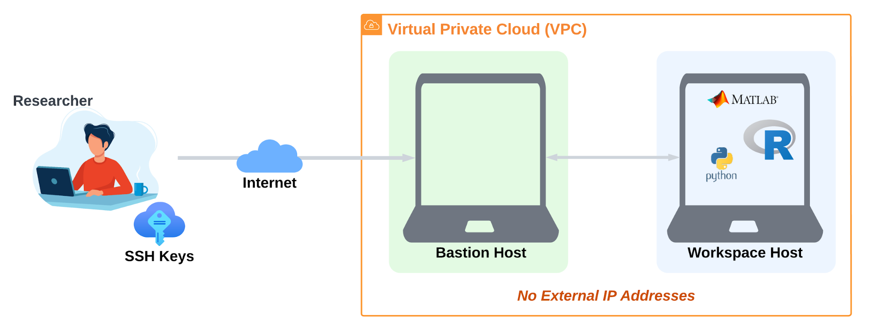
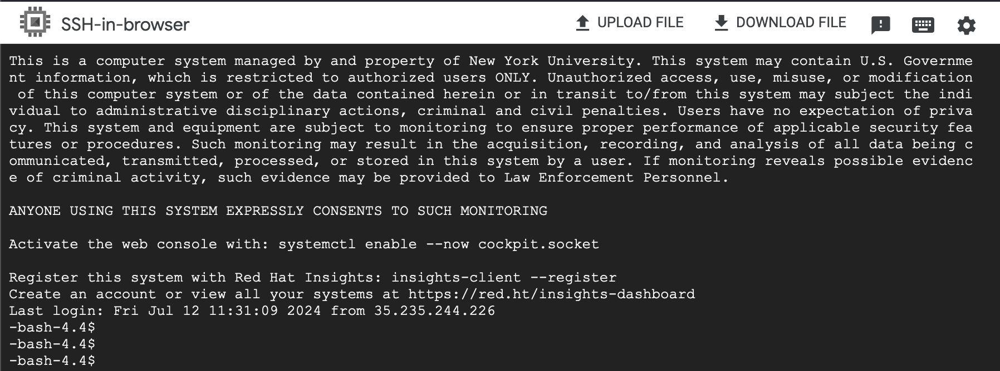

# SRDE User Guide

Remote access to the secure environment workspace via the Command Line Interface. The SRDE consists of two separate servers: 
-   The Workspace Host is where you access and analyze data
-   The Bastion Host acts as a proxy that allows your laptop/workstation to connect securely via the internet to the Workspace Host.

Accessing the Secure environment Workspace Host remotely via the Command Line Interface (CLI) is a two-step process: First you must connect to the Bastion Host and then from the Bastion Host access your Workspace Host.  The two-step process is demonstrated below:


This two-step process is enabled with the use of SSH keys and SSH Agent Forwarding and is described in detail for some of the common Operating Systems (MacOS/Linux and Windows)  in the following sections of the User Guide. For more general information about using SSH keys and the use of Bastion Host [see here](https://medium.com/devops-dudes/setting-up-an-ssh-agent-to-access-the-bastion-in-vpc-532918577949).

User access to the secure environment is controlled by [Identity-Aware Proxy (IAP)](https://cloud.google.com/security/products/iap?hl=en) Google Cloud service. IAP provides a central way of managing user access and enforcing access control policies, without requiring external/public IP addresses on the Bastion Host and the Workspace Host.

::::tip[Prerequisites]
In order to be able to access your Secure Environment Workspace Host, you will need the following information, provided by the Secure Research Data Admins:
-   **Project Id** for the Bastion Host (ex. test-dev1-bastion-1234)    
-   **Zone Name** (ex. us-east4-a)

:::note
At this time you are not required to be on the NYU Network (or VPN into the NYU Network) in order to access the Secure Environment workspace.

:::

::::


## Connecting through Google Cloud Console
Navigate to Google Cloud Console https://console.cloud.google.com/welcome and login with your NetID. Click the Select a project drop-down list at the top left corner of the page. In the Select a project window that appears, search and select the bastion project using the provided project ID (ex. test-dev1-bastion-1234).


Once selected, navigate to the VM Instances page via the Navigation menu (Menu in the top left corner of the page ) > Compute Engine > VM Instances. A running Bastion instance will be visible in the page as shown below:


ssh to the Bastion instance by clicking on the SSH button, a new SSH-in-browser tab will appear with a restricted CLI ( Command line interface ) connected to the instance. We are now inside the Bastion Host. 



Now we can ssh to our workspace host by using the workspace internal IP address `10.0.0.2`: 
```sh
ssh 10.0.0.2
```
This will open the workspace CLI, with access to the workspace host having the computing needs to work on our data.

## Connecting through Google Cloud Shell

Navigate to https://shell.cloud.google.com/ while logged in using your NetID.

### Setting project and zone

Note - Ask your SRDE administrator for the appropriate GCP PROJECT_ID and ZONE_NAME. Replace the values in the two commands below and run them


```sh
gcloud config set project PROJECT_ID
gcloud config set compute/zone ZONE_NAME
```

### Confirm settings

Before proceeding, confirm that the project and zone match your GCP project ID and zone:


```sh
gcloud config list


[compute]
region = us-east4
zone = us-east4-a
[core]
account = netid@nyu.edu
disable_usage_reporting = False
project = test-dev1-bastion-1234


Your active configuration is: [default]
```


### Generate SSH keys

:::tip[Unused keys expire!]
Google Cloud Shell will delete your files, including generated SSH keys, if they are not accessed for 120 days. If this happens you will need to generate them again.

:::

The simplest way to generate SSH keys is to delegate the key generation to gcloud. In order to trigger key creation, run the following command. 

:::note
Ignore the result of this command. It will most likely print errors to the output console.

:::

```sh
gcloud compute ssh bastion-vm
```

You will be prompted to enter an SSH passphrase. This is optional, however it is recommended for additional user security.


The above command should log you into the bastion VM. You will see a prompt like:
```sh
-bash-4.4$”
```
Before proceeding, exit back to your local machine

```sh
exit
```

Then make sure the above step created two keys in your ssh home directory (`~/.ssh`) as shown below:

```sh
ls ~/.ssh
```


Start the ssh-agent on your local machine

```sh
eval `ssh-agent -s`
```
Add the google_compute_engine key to your ssh session

```sh
ssh-add ~/.ssh/google_compute_engine
```
Connect to the instance with gcloud using the –ssh-flag-”-A” flag
:::note
This command uses the default project and zone set above.

:::

```sh
gcloud compute ssh bastion-vm --ssh-flag="-A"  --tunnel-through-iap
```

### Add SSH key to session
Run the following command to add the google_compute_engine key to the current session:ssh
```sh
ssh-add -L
```
Connect to the workstation-vm

```sh
ssh 10.0.0.2
```

### Future logins
After the initial login, you will not need to regenerate the SSH keys, but you will need the rest of the command sequence from “Start the SSH agent”. On your local machine:
```sh
eval `ssh-agent -s`
ssh-add ~/.ssh/google_compute_engine 
gcloud compute ssh bastion-vm --ssh-flag="-A" --tunnel-through-iap --project=PROJECT_ID
```

And then on the bastion VM:

```sh
ssh 10.0.0.2
```
