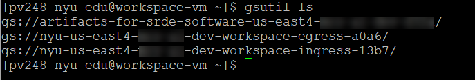
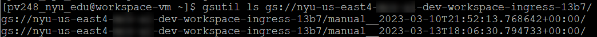
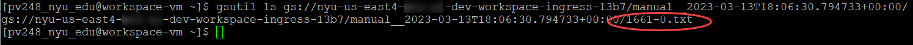
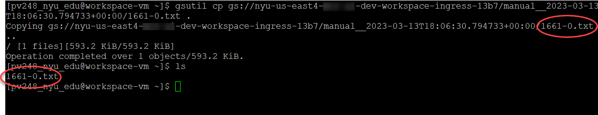

# Data Access
After you are connected to the Workspace Host using SSH per the instructions in the previous section, you can access data that has been placed in the workspace ingress bucket by your Data Steward. You can use the gsutil ls and cp commands to copy the data into your home directory using the steps described below.

Use the following command to see list of folders in your workspace:
```sh
gsutil ls
```



As shown above, there are several folders. Data that has been transferred into the workspace is in the Ingress folder.  Use the following command to list the objects in the ingress folder, replacing the path with your project’s path:

```sh
gsutil ls gs://your-workspace-ingress-path
```



List the contents of the folder with the timestamp corresponding to the date the data was transferred into the workspace, and you will see the files that were uploaded:
```sh
gsutil ls gs://your-workspace-ingress-path/data-timestamp-folder
```



To copy the files into your home directory use gsutil cp command (use period at end to copy to your home directory):

```sh
gsutil cp gs://your-workspace-ingress-path/data-timestamp-folder/filename .
```


