# Managing Data Transfer

Every research project that is using the Secure Research Data Environment (SRDE) must have an assigned Data Steward. The Data Steward is responsible for  ingesting to and egressing data from the secure environment, following the processes described below. Currently, the data steward role cannot be combined with other roles in the project, in other words, a data steward cannot also be a user/researcher in the project.

:::tip[Data Steward role]
The project PI must inform the SRDE team who the assigned Data Steward is for the research project before the project is deployed on the SRDE.

:::

## Data Ingestion process

Ingesting data into the secure environment is a two-step process; First the Data Steward must upload the data onto the staging GCP Storage Bucket and then “push” the data into the secure Workspace environment.
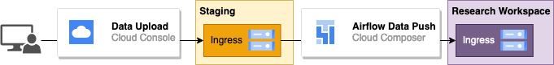

### Uploading Data to the Staging Area

#### Option1: Using the Web Console Interface
Log into GCP console, set project to your staging project (i.e. srde-staging-dev), and navigate on the side panel to Cloud Storage -> Buckets:
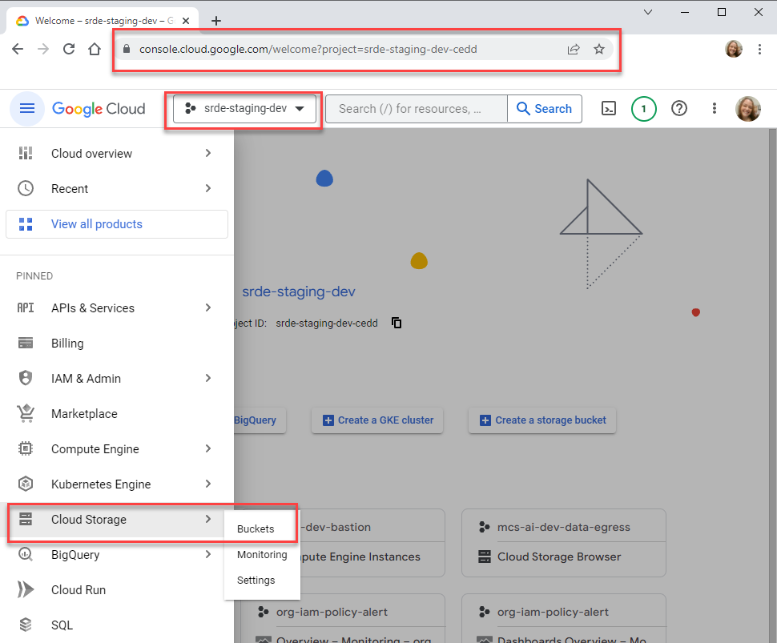

Navigate to your research workspace’s corresponding Staging Ingress bucket:
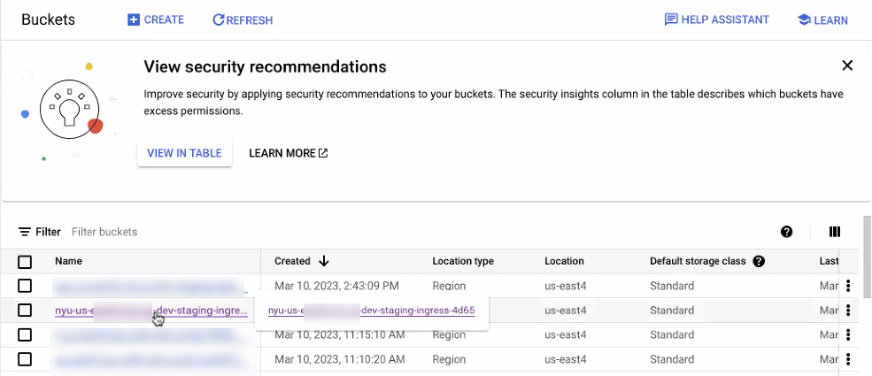

Copy data to the Staging Ingress bucket:
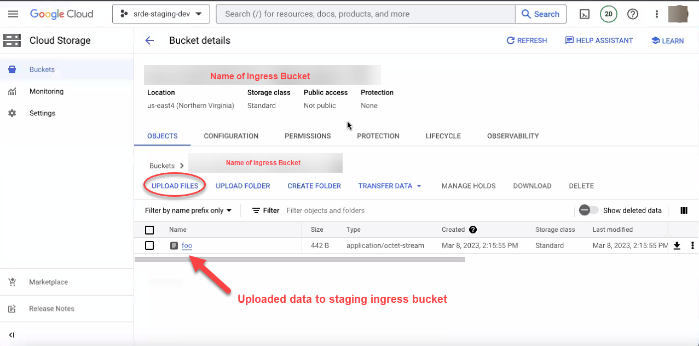

#### Option2: Using the CLI
Follow the instructions in section 2 to install and configure gcloud on your workstation.  Once this is done, run the following command to find your workspace’s bucket:
```sh
gsutil ls | fgrep [Workspace Name]
```

The workspace name will be given to you by the SRDE team after your workspace has been provisioned.  The command above should output two buckets– one will be for data ingest (ingress) and the other will be for data egress:
```sh
nyu10003@cloudshell:~ (srde-staging-dev-cedd)$ gsutil ls | fgrep example
gs://nyu-us-east4-example-staging-egress-9d94/
gs://nyu-us-east4-example-staging-ingress-4bd9/
```

To ingest data into the SRDE, run the following command to copy individual files into the ingress bucket:
```sh
gsutil cp [FILENAME] gs://[INGRESS BUCKET]
```

So for instance, the following command would copy an individual text file (1661-0.txt) into the example ingress bucket:
```sh
gsutil cp 1661-0.txt gs://nyu-us-east4-example-staging-ingress-4bd9/
```

To copy a folder, you need to add -r after cp:
```sh
gsutil cp -r [FOLDER] gs://[INGRESS BUCKET]
```

We would use the following command to copy a folder named dataset into the example ingress bucket:
```sh
gsutil cp -r dataset gs://nyu-us-east4-example-staging-ingress-4bd9/
```

### Push Data to the Research Workspace Using Airflow
Once the data is in the Staging Ingress bucket, navigate to Cloud Composer and click on Airflow:
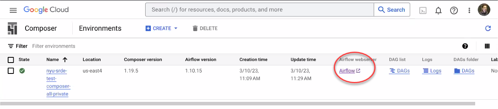

In Airflow you will see the DAG workflows for your project. If you do not see any DAGs, contact srde-support@nyu.edu with subject line “Missing Airflow Permissions”
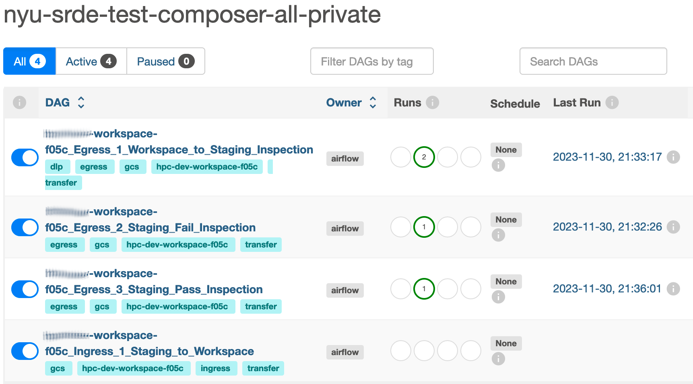

Once you see the workflows for your project, pick the one named **[project-id]_Ingress_1_Staging_to_Workspace**, which will bring you to the DAG page. On the DAG page, click on the “play” button at the top right to trigger the DAG:
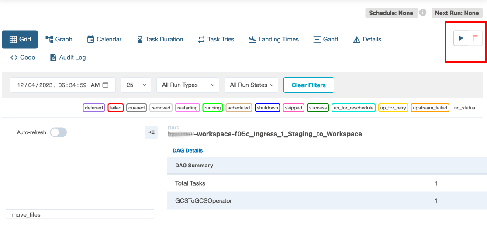

The DAG may take a few minutes to run. You can see its progress in the status display  on the bottom left.
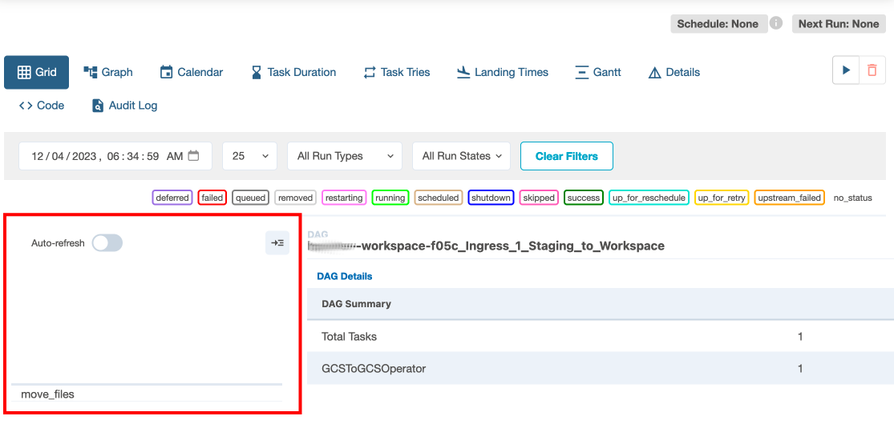

The display shows a list of tasks executed by the DAG. A light green square will appear next to the task when it is running, and turn dark green when it is complete. When all tasks have finished successfully, the DAG is done. 

Researchers will now be able to see the data in the ingress bucket in the research project workspace.

:::note[Access policy for Data Stewards]
Data stewards do not have access to the research project workspace.
:::

Instructions for researchers who need to access the ingested data in the research workspace are found in the [Data Access section](02_data_access.mdx) of this document.

## Data Egress Process
To transport data out of the SRDE project workspace, research team members copy files to be exported to the 'export' folder in the Researcher Workspace Egress bucket, sample command below:
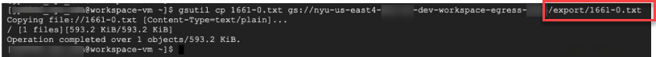

After the files have been copied to the export folder in the egress bucket within the workspace, researchers will notify the Data Steward that they are ready to export.  The Data Steward will first move the files to the Staging Egress folder and scan them using the Data Loss Prevention API, a tool for automatically detecting sensitive data types. Next, they will check the generated report and either pass the inspection or fail it. Passing the inspection moves the data onwards to the Research Data Egress project for external sharing. Failing the inspection blocks the export.
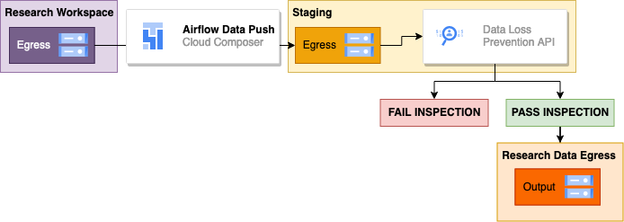

### Push the data from the Research Workspace to Staging
First, run Egress DAG #1 to move files to the Staging Egress folder. Follow the same instructions as above to navigate to the Airflow page. 

Once on the Airflow page, find the DAG named **[project-id]_Egress_1_Workspace_to_Staging_Inspection.**
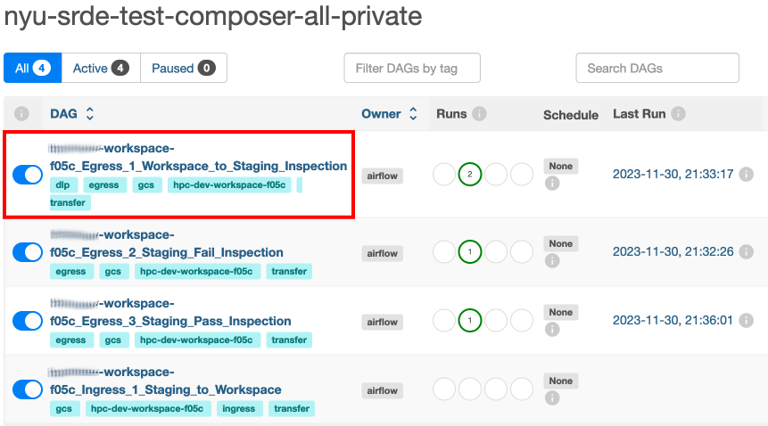

Once on the DAG page, follow the steps to trigger the DAG, as instructed above. This DAG executes several tasks:
-   An archive copy of the export files is created within the workspace.
-   The export files are moved to the staging environment.
-   A DLP inspection is run to scan the exported files for sensitive data.
The DLP scan may take some time to run, so wait for all tasks to be marked as successful (dark green) before proceeding.

### Check the DLP inspection report
After Stage 1 is successfully completed, the DLP inspection findings are written to BigQuery.  To examine results, navigate to BigQuery by going to Google console webpage, typing BigQuery on the search bar, and selecting it from the list.
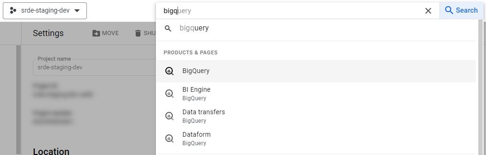

Once in BigQuery, on the Explorer tab on the left, click on the corresponding project, then on the table that corresponds to the scan that was done. The name will contain the UTC date and time of the scan, using the format **dlp_YYYY-MM-DD-HHMMSS**. You can verify the report’s creation time under the “Details” tab.
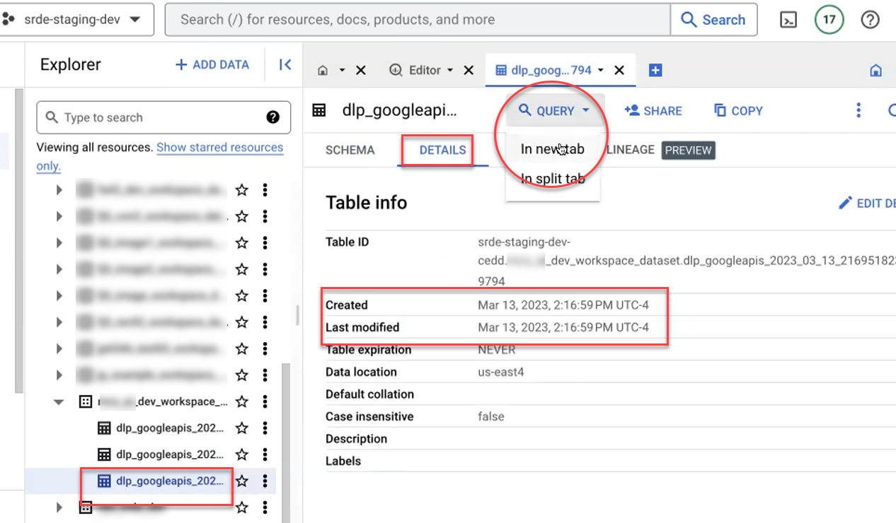

Select “Query > In new tab” to examine the results. The following default query will return a sample of 1000 results:
```sh
SELECT * FROM “table_id” LIMIT 1000
```
For more information on querying the DLP report, see the DLP Interpretation Guide (TODO Add section on DLP Interp. guide!)

Click on Run to run the query and review the results of the scan. After running the query you will see the results on the lower half of the window:
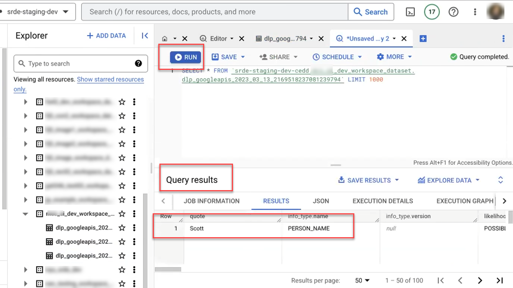

### Pass or fail the inspection

Once the results are reviewed, the Data Steward approves or denies movement to the external egress bucket.  They navigate back to the Airflow page and choose one of the following options:
-   If DLP scan results are NOT approved, Data Steward fails the data export by running **Egress_2_Staging_Fail_inspection**. Once on the DAG page, follow the steps to trigger the DAG, as instructed above. The data will be fully deleted from staging, and only the archived copy will remain in the workspace.
-   If DLP scan results ARE approved, Data Steward passes the data export by running **Egress_3_Staging_Pass_Inspection**. Once on the DAG page, follow the steps to trigger the DAG, as instructed above. The data will be transferred to the project’s external egress bucket, where the researchers will be able to access and share it.
After the final egress DAG completes successfully, the Data Steward should notify the researchers either a) that their data is available in the external egress bucket or b) that their data export was denied and why.

## Moving Files to Export
You can use the gsutil cp command to copy data from your home directory to the Egress export folder in the workspace using the following steps. Use the gsutil ls command to see the list of folders in your workspace. Copy your file into the Egress folder, adding /export/yourfilename to the Egress folder path:
```sh
gsutil cp data_file.txt gs://egress_bucket_path/export/data_file.txt
```
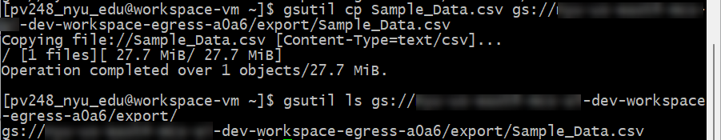

## Auto-Inspection
When files are added to the export folder, they are automatically scanned for sensitive data using the Data Loss Prevention API. This is the same tool that the Data Steward will use to examine your exported data and approve or deny the export, so you should review the results of auto-inspection carefully. Before notifying the Data Steward that an export is ready, make sure that the DLP inspection does not detect sensitive info, or that if it does, you are aware of the items it flags and can explain why they are false alarms.

The DLP scan is automatically triggered by any new file in the export folder. It may take several minutes to run. When it is complete, a summary file will be written back to the “dlp” folder in the egress bucket.
```sh
gsutil ls gs://egress_bucket_path/dlp
```
Within this folder, a folder is created for each exported file, and within that are dated summary reports for each version.
```sh
gsutil ls gs://egress_bucket_path/dlp/data_file.txt/
```
You should see a file of the format **dlp_results_YYYY-MM-DD-HHMMSS** corresponding to approximately when you added the file to the export folder. Note that the scan takes about a minute to pick up new files, and may behave oddly if you upload several versions very close together.

To see the summary file contents, use the command:
```sh
gsutil cat gs://egress_bucket_path/dlp/data_file.txt/dlp_results_YYYY-MM-DD-HHMMSS 
```

If sensitive information is detected, you will see it listed by type and count
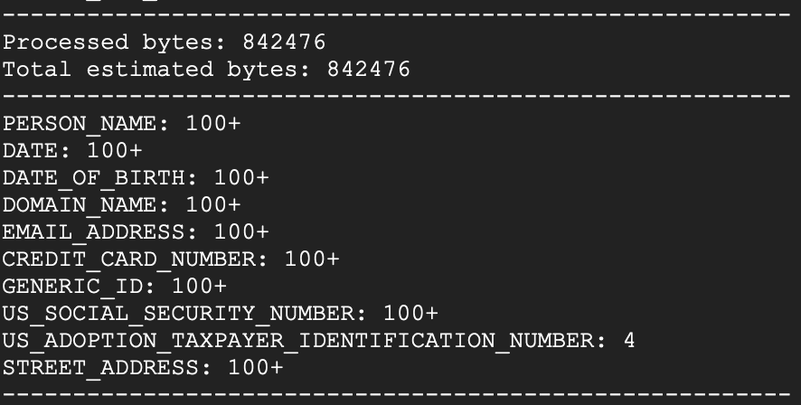

If no sensitive information is detected, you will see a clean scan report. Double-check that the “Processed bytes” and “Total estimated bytes” approximately line up with the size of your file–if both values are 0 it is likely that there was an error in the scan.
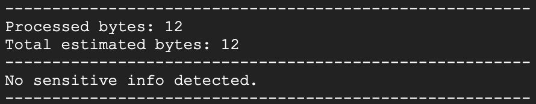


