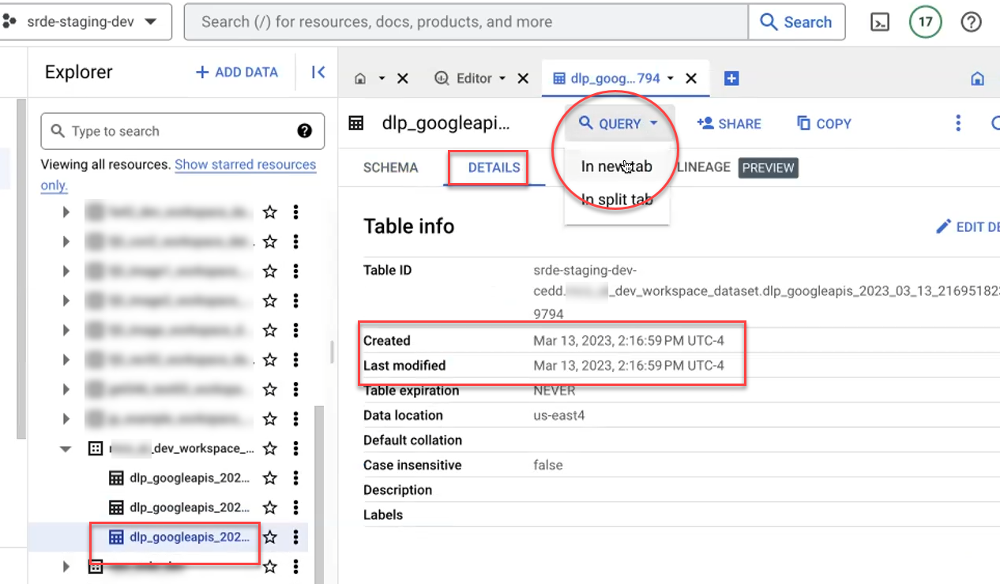

# DLP Interpretation Guide

Data Loss Prevention (DLP) is a tool provided by Google Cloud that automatically detects potentially sensitive information such as names, dates, social security numbers, credit card numbers, etc. As part of the SRDE egress process, we run a DLP scan to help the data steward more easily judge whether the data being exported is in compliance with the relevant data use agreement(s). The scan will flag any information it considers potentially sensitive, and it is up to the data steward to review the results and either approve the export or send it back to the researchers for further review.

The DLP scan is triggered by the Egress_2 script as part of the [data egress process](../02_user_guide/03_data_transfers.mdx). Once it is generated, you can explore the table of flagged items in BigQuery. First, open a query tab as shown in the screenshot below, and then use SQL queries like the examples in this guide to check specific items and view overall statistics on the table.




:::note
 DLP is just a tool, and it is not infallible. Use your best judgment, and if you see results that look confusing, get in touch with the PI for clarification.
:::

## Viewing results from the DLP report

This query, the most basic, fetches the first 100 flagged items in the report.
```sh
SELECT
 quote,
 info_type.name,
 info_type.sensitivity_score.score,
 likelihood
FROM `your_table_name` LIMIT 100
```

Each row of the report contains a great deal of metadata on where the potentially sensitive metadata was found, as well as metadata on the DLP scan itself, but here we select only the following four columns:
-   **quote**: the span of text that was flagged as sensitive info
-   **info_type.name**: the type of sensitive info
-   **Info_type.sensitivity_score.score**: the sensitivity level (LOW, MODERATE, or HIGH)
-   **likelihood**: the confidence with which the DLP tool has flagged the item (POSSIBLE, LIKELY, or VERY_LIKELY)

The results should look something like this. As you can see, the same piece of text may be flagged multiple times with different types, depending on the results of DLP’s auto-detection algorithms.


To see more results, you can adjust the value of the `LIMIT` clause or remove it entirely. Alternatively, use some of the sample queries below to view targeted subsets of the data.

## Sample Queries: selecting a subset of flagged items

Select only high-sensitivity items
```sh
SELECT quote, info_type.name, info_type.sensitivity_score.score, likelihood
FROM `your_table_name`
WHERE info_type.sensitivity_score.score = "SENSITIVITY_HIGH"
LIMIT 100
```

Select only items that are high-sensitivity and have a likelihood higher than “possible”
```sh
SELECT quote, info_type.name, info_type.sensitivity_score.score, likelihood
FROM `your_table_name`
WHERE info_type.sensitivity_score.score = "SENSITIVITY_HIGH"
AND likelihood != "POSSIBLE"
LIMIT 100
```

Select all items, sorted by type
```sh
SELECT quote, info_type.name, info_type.sensitivity_score.score, likelihood
FROM `your_table_name`
ORDER BY info_type.name
```

Select all items of type PERSON_NAME, ordered alphabetically
```sh
SELECT quote, info_type.name, info_type.sensitivity_score.score, likelihood
FROM `your_table_name`
WHERE info_type.name = "PERSON_NAME"
ORDER BY quote
```
